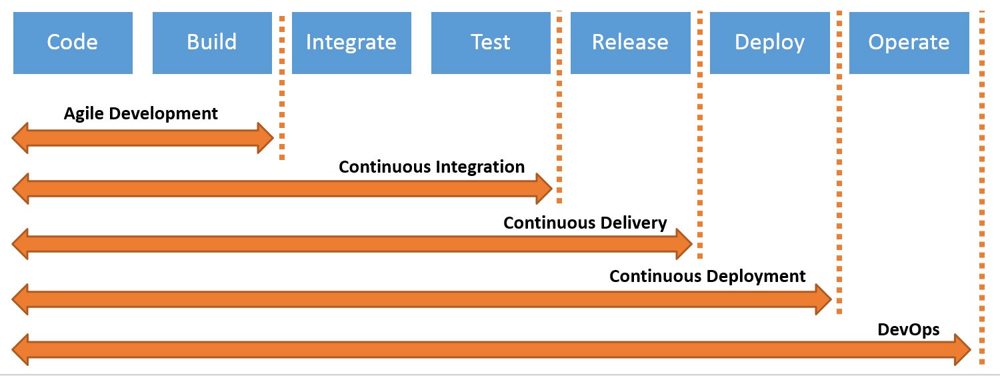

### SDLC (Software development lifecycle)
- Plan
- Implement
- Test
- Deploy
- Maintain

### developers vs operations
- developers code and test the application or new features
- when the app or feature becomes releasable
- they hand it over to operations team

- operation teams deploy the app into production
- also makes sure that there is no downtime introducing the new feature
- handle huge traffic/load by making sure underlying infra is good

- as two roles are very different in their job, there is always a communication gap
- Developers are change agents. They are incentivised to change the code.
- Operations are Stability agents. They are incentivised to keep stability. The simplest way to stay stable is to refuse change. 
- DevOps culture creates synergy between Dev and Ops so they are incentivised to work together
- Emperical quality through automated testing enables trust that Developers changes can be accpeted by Ops
- Automated deployment and change control build trust that Ops will accept high quality code changes in a timely mannor
- devops is people, process and tooling  to enable change ( value ) to happen quickly without sacraficing quality. 

### agile model
- plan, implement, deploy, feedback, fix, deploy
- introduction of CI/CD (Continous Integration/Continous Delivery)

